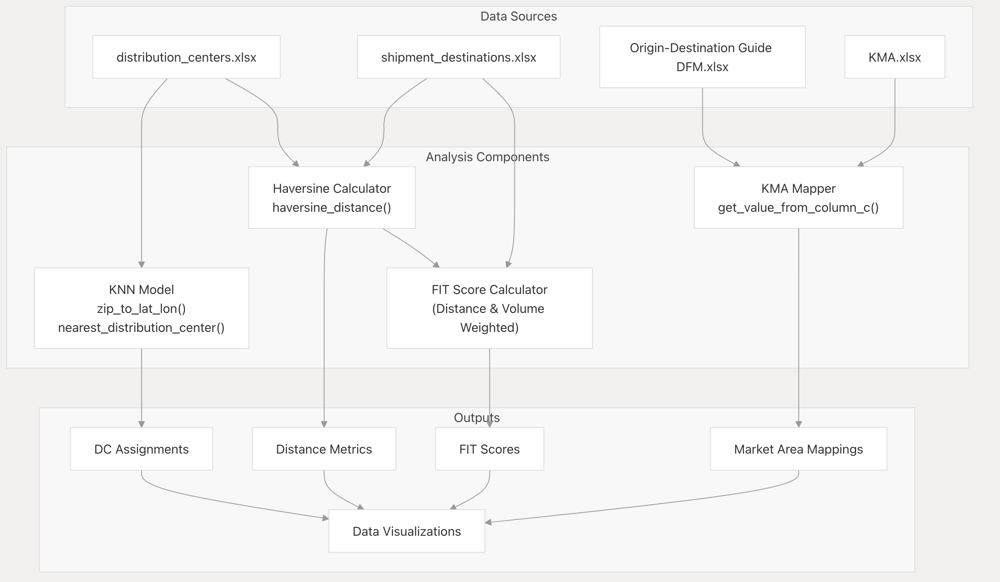
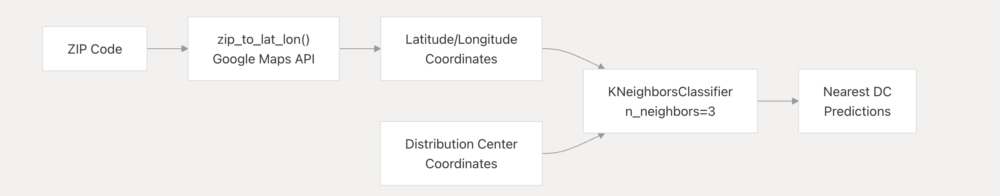
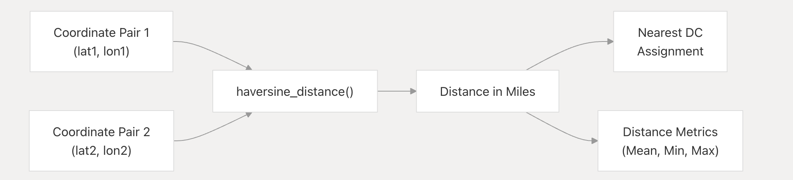
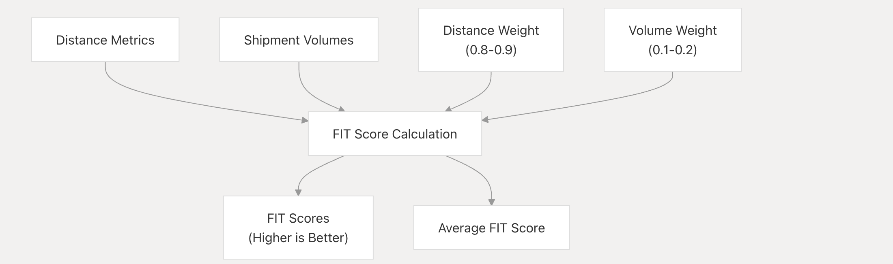
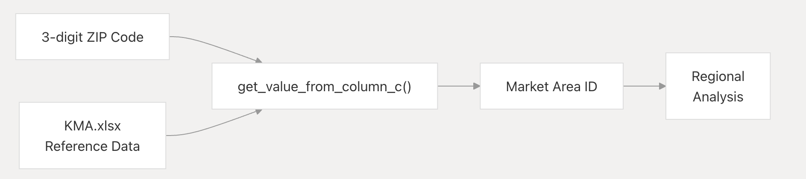
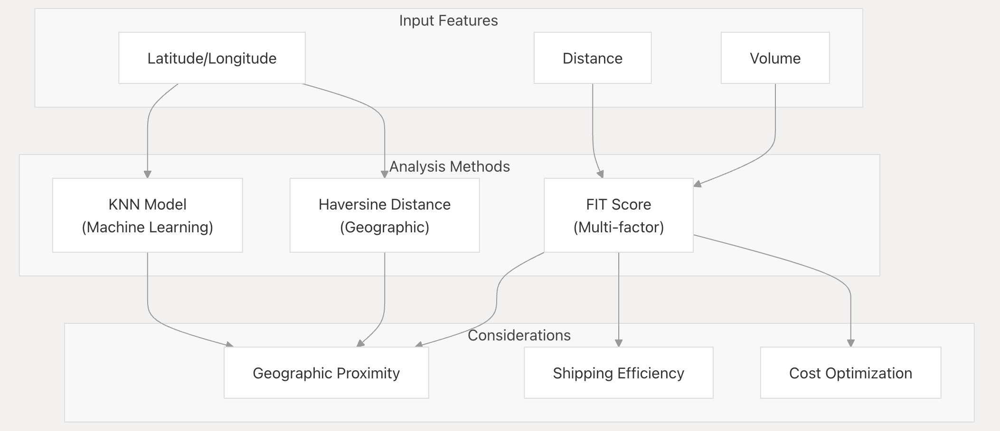
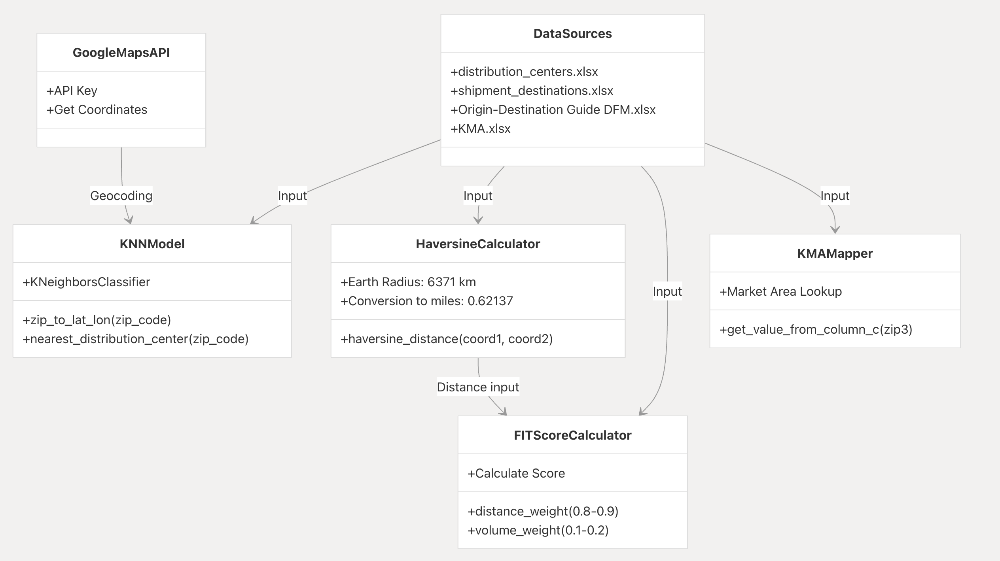

# $${\color{red}Network-Overlap-Detector}$$	

## $${\color{red}Overview}$$
The Target Transportation Network Overlap Tool is a comprehensive system designed to analyze distribution networks and optimize the assignment of distribution centers to shipment destinations. This tool employs multiple analytical methods, including machine learning, geographic distance calculations, and multi-factor scoring, to provide data-driven insights for transportation network optimization.

This overview page introduces the core components and architecture of the system. 

## $${\color{red}Purpose-And-Scope}$$
The primary purpose of the Transportation Network Overlap Tool is to:

1. Determine optimal distribution center assignments for shipment destinations
2. Calculate distance metrics between origins and destinations
3. Evaluate assignment quality using weighted scoring methods
4. Map destinations to key market areas for regional analysis
5. Visualize transportation network data for decision-making

## $${\color{red}System-Architecture}$$
The system consists of four primary analytical components that work with shared data sources to produce various outputs for transportation network analysis.

# $${\color{red}Core-Components}$$
## $${\color{red}KNN-Model}$$
The K-Nearest Neighbors model is implemented to predict the nearest distribution center for shipment destinations based on geographical coordinates.

## $${\color{red}Haversine-Distance-Calculator}$$
This component calculates the great-circle distance between two geographical points using the Haversine formula, accounting for the curvature of the Earth.

## $${\color{red}FIT-Score-Calculator}$$
The FIT Score provides a weighted evaluation metric that considers both distance and shipment volume in determining optimal distribution center assignments.

## $${\color{red}Key-Market-Area-Mapper}$$
This component maps ZIP codes to predefined market areas, enabling regional analysis of the distribution network.

## $${\color{red}Data-Sources}$$

The system utilizes several Excel files as data sources:

File Name			Description						Key Fields
distribution_centers.xlsx	Contains information about distribution centers	id, Latitude, Longitude
shipment_destinations.xlsx	Contains information about shipment destinations	Name, Latitude, Longitude, Volume
Origin-Destination Guide DFM.xlsx	Contains origin-destination pairing information	Various fields for logistics planning
KMA.xlsx	Contains Key Market Area mapping data	3-digit Zip, Market Area ID, Market Area Name, Region

To run on your own, you will need two excel files with zip codes formatted as (latitude, longitude) coordinates.
## $${\color{red}Methodoligical-Comparisons}$$
The system employs multiple methods for distribution center assignment and evaluation, each with different considerations:

## $${\color{red}Analysis-and-Visualization}$$
The tool includes various methods for analyzing and visualizing the transportation network data:

1, Distance Metrics Analysis:

- Average distance between destinations and assigned DCs
- Minimum and maximum distances
- Statistical distribution of distances

2. FIT Score Analysis:

- Weighted scoring that balances distance and volume
- Average FIT scores for top lanes

3. Visualizations:

- Bar graphs showing distances by distribution center
- Scatter plots for relationship analysis
- Choropleth maps for geographic data representation

## $${\color{red}Key-Implementation-Concepts}$$
The system is implemented as a collection of Jupyter notebooks, each focusing on specific aspects of the transportation network analysis:

# $${\color{red}Summary}$$
The Transportation Network Overlap Tool provides a comprehensive framework for analyzing and optimizing distribution networks through multiple analytical approaches. By combining machine learning models, geographic distance calculations, multi-factor scoring, and regional market mapping, the tool enables data-driven decision-making for transportation network optimization.

#  $${\color{red}Code:}$$

	   	#Import Packages
		
		import math
		import pandas as pd
		import numpy as np
		import plotly.express as px
		
		# Haversine distance calculations
		def haversine_distance(coord1, coord2):
		    lat1, lon1 = coord1
		    lat2, lon2 = coord2
		    R = 6371  # Earth's radius in kilometers
		    dlat = math.radians(lat2 - lat1)
		    dlon = math.radians(lon2 - lon1)
		    a = (math.sin(dlat / 2) * math.sin(dlat / 2) +
		         math.cos(math.radians(lat1)) * math.cos(math.radians(lat2)) *
		         math.sin(dlon / 2) * math.sin(dlon / 2))
		    c = 2 * math.atan2(math.sqrt(a), math.sqrt(1 - a))
		    distance1 = R * c
		    distance = distance1 * 0.62137  # Convert KM to M
		    return distance
		
		# Read data from Excel files into pandas DataFrames
		shipment_destinations = pd.read_excel('Buchannan.xlsx')
		distribution_centers = pd.read_excel('distribution_centers.xlsx')
		
		nearest_dc = []  # Create variable called 'nearest_dc' to hold both lists
		
		for index1, destination in shipment_destinations.iterrows():
		    min_distance = float('inf')
		    nearest_center = None
		
		    for index2, center in distribution_centers.iterrows():
		        distance = haversine_distance(destination[['Latitude', 'Longitude']], center[['Latitude', 'Longitude']])
		
		        if distance < min_distance:
		            min_distance = distance
		            nearest_center = center['id']
		
		    nearest_dc.append({'destination_id': destination['Name'], 'nearest_dc_id': nearest_center, 'distance': min_distance})
		
		print(nearest_dc)  # Show results of the function
		[{'destination_id': 'San Bernardino', 'nearest_dc_id': 'Target LOC NRCL', 'distance': 7.655975054103792}, {'destination_id': 'Phoenix', 'nearest_dc_id': 'Target LOC T0588', 'distance': 6.447035818423189}, {'destination_id': 'Las Vegas', 'nearest_dc_id': 'Target LOC T3806', 'distance': 128.81193049207542}, {'destination_id': 'Chicago', 'nearest_dc_id': 'Target LOC T3865', 'distance': 9.626437687611766}, {'destination_id': 'Indianapolis', 'nearest_dc_id': 'Target LOC T0559', 'distance': 3.378277526773674}, {'destination_id': 'Edison', 'nearest_dc_id': 'Target LOC T3687', 'distance': 9.57525620948898}, {'destination_id': 'Houston', 'nearest_dc_id': 'Target LOC T0578', 'distance': 189.1901805039871}, {'destination_id': 'Irving', 'nearest_dc_id': 'Target LOC SDQD', 'distance': 7.4005336905560855}, {'destination_id': 'Garland', 'nearest_dc_id': 'Target LOC SDQD', 'distance': 9.502995487797588}, {'destination_id': 'Atlanta', 'nearest_dc_id': 'Target LOC SOCS', 'distance': 14.57469692732008}, {'destination_id': 'Oklahoma City', 'nearest_dc_id': 'Target LOC SDQD', 'distance': 186.88951509397882}, {'destination_id': 'Union City', 'nearest_dc_id': 'Target LOC SOCS', 'distance': 14.665452573610489}, {'destination_id': 'Shepherdsville', 'nearest_dc_id': 'Target LOC T0559', 'distance': 142.34024171218724}]
		#create dataframe
		Name	Zip	Latitude	Longitude	Annual Volume	id	Rate
		(CCXP, 31407.0, nan, 32.0187, -81.0967, nan, Target LOC CCXP, Shipper , 5.0, 5, NY_BRN, Brooklyn Mkt, Brooklyn, NY, Northeast, 11747, nan, nan, 5)	NaN	NaN	NaN	NaN	NaN	NaN	NaN
		(CCXV, 23434.0, nan, 36.8133, -76.3079, nan, Target LOC CCXV, Shipper , nan, 10, MA_SPR, Springfield Mkt, Springfield, MA, Northeast, 1373, nan, nan, 10)	NaN	NaN	NaN	NaN	NaN	NaN	NaN
		(YLAW, 98390.0, nan, 47.2458, -123.149, nan, Target LOC YLAW, Shipper , nan, 11, MA_SPR, Springfield Mkt, Springfield, MA, Northeast, 1373, nan, nan, 11)	NaN	NaN	NaN	NaN	NaN	NaN	NaN
		(YWDC, 90810.0, nan, 33.8183, -118.3517, nan, Target LOC YWDC, Shipper , nan, 12, MA_SPR, Springfield Mkt, Springfield, MA, Northeast, 1373, nan, nan, 12)	NaN	NaN	NaN	NaN	NaN	NaN	NaN
		(YLTA, 29407.0, nan, 32.8014, -80.0258, nan, Target LOC YLTA, Shipper , nan, 13, MA_SPR, Springfield Mkt, Springfield, MA, Northeast, 1373, nan, nan, 13)	NaN	NaN	NaN	NaN	NaN	NaN	NaN
		#create analytical variables for general information and creation of weighted score downstream
		dist_col = df['distance']
		dist_col = dist_col[~np.isnan(dist_col)] # remove missing values
		dist_col = dist_col[dist_col != np.inf] # remove infinite values
		max_dist = dist_col.max()
		mean_dist = dist_col.mean()
		min_dist = dist_col.min()
		max_dist = dist_col.max()
		mean_dist =  dist_col.mean()
		min_dist = dist_col.min()
		distance_weight = .8 #weight assigned to distance 
		volume_weight = 0.2 #weight assigned to volume
		
		#show results
		print('Average distance:', mean_dist)
		print('Minimum distance:', min_dist)
		print('Maximum distance:', max_dist)
		Average distance: 56.158348367531865
		Minimum distance: 3.378277526773674
		Maximum distance: 189.1901805039871
		mean_vol = 915
		max_volume = 3732
		score2 = 1 - ((dist_col / max_dist) * distance_weight + (mean_vol / max_volume) * volume_weight)
		score2 = score2.clip(lower=.0)
		print(score2)
		mean_score2 = np.mean(score2)
		
		print("Average FIT Score for Top lanes:", mean_score2) 
		#Score with distance and volume
		    
		#scores for destinations
		
		#all fits 
		
		#Mileage bands
		0     0.918591
		1     0.923703
		2     0.406277
		3     0.910259
		4     0.936679
		5     0.910475
		6     0.150965
		7     0.919671
		8     0.910781
		9     0.889335
		10    0.160693
		11    0.888951
		12    0.349072
		Name: distance, dtype: float64
		Average FIT Score for Top lanes: 0.7134962871306105
		# Create the bar graph
		fig = px.bar(df, x="origin_id", y="distance", color="nearest_dc_id",  title="Miles of Top Lanes to Target DC")
		fig.show()
		#3d bubble chart
		# o & d -> Volume size of bubble
		
		fig = px.scatter(df, x="origin_id", y="distance",
			         size="distance", color="nearest_dc_id",
		                 hover_name="nearest_dc_id", log_x=True, size_max=200)
		fig.show()
		fig = px.scatter(df, x="origin_id", y="distance", size="distance", color="nearest_dc_id",
		                 hover_name="nearest_dc_id", log_x=True, size_max=200)
		
		fig.show()
		
		df.head()
		origin_id	nearest_dc_id	distance
		0	San Bernardino-480	Target LOC NRCL	7.655975
		1	Phoenix-600	Target LOC T0588	6.447036
		2	Las Vegas-240	Target LOC T3806	128.811930
		3	Chicago-3732	Target LOC T3865	9.626438
		4	Indianapolis-2928	Target LOC T0559	3.378278
		fig.show()
		
		# Create the scatter bubble graph
		fig = px.scatter(df, x="origin_id", y="distance", color="nearest_dc_id", size="distance", title="Miles of Top Lanes to Target DC")
		fig.show()

   More detail may be found at: https://deepwiki.com/nbergeland/-Target-Transportation_Network_Overlap_Tool
		 
